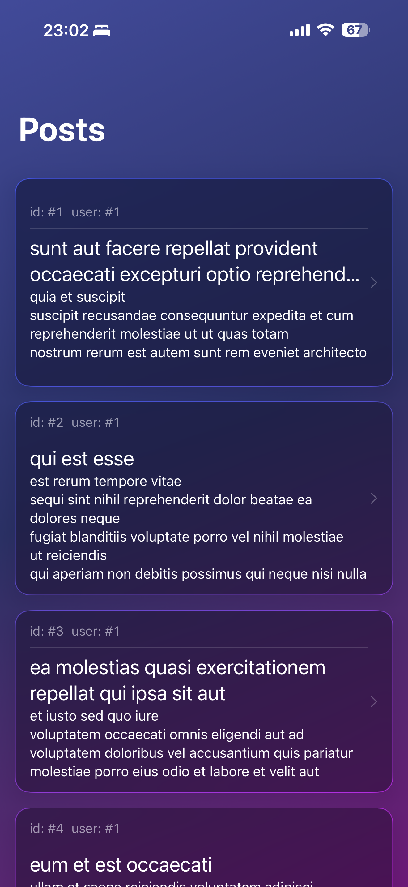
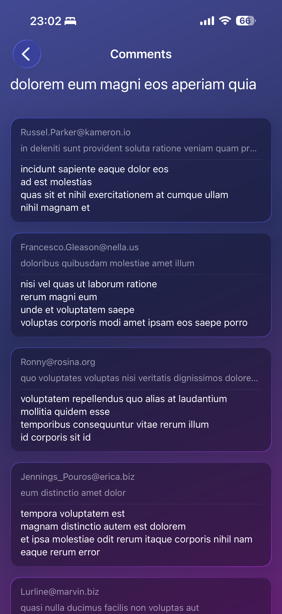

# About this project

The project is in Swift 6 and built for iOS26. And Swift Testing is used for unit tests.

## Architecture

```
Presentation
    - Views (dumb, just render state)
    - ViewModels (manages state and executes use cases (business logic))

Business Logic
    - Use cases (business logic) only one unit of business logic per use case

Service
    - API clients (fetches data from the API)
    - Models (data structures for the API responses)
    - Repository (aggregates services behind a single interface)
```

Dependencies are injected, use cases (business logic) are tested.

I used `nonisolated` to opt out of `@MainActor` (project setting `SWIFT_DEFAULT_ACTOR_ISOLATION = MainActor`) for services and use cases, actually for all non-UI types, so they can run on background threads. I did not use `actor` for these since there is no shared mutable state and the use cases are stateless.

A minimal "DesignSystem" is used for colors via semantic tokens.

## Features

The project has 3 "features": `BlogRepository`, `PostsService` and `CommentsService`. Each feature has a feature spec `.md` file for future use for scaffolding and generating feature/module structure and packaging, and as context for AI agents. Each feature has 3 distinct parts, `API` (public interfaces), `Impl` (internal implementation), `TestUtils` (mocks and fakes).

## AI

The code is, mostly, not generated by AI. But since code is best generated using an agent these days I did add a `CLAUDE.md` file in the root describing the project after I set up the structure and done a few iterations by hand. After that I used Claude Code with the `swift-concurrency` and `swiftui-expert-skill` to review the code to make sure it was well written. Claude also took the initial commit. So he got all the credit, so I had to add a comment about that. ;)

## Extra

I felt like the task was pretty small and didn't really showcase certain things. So I added some extra that will enable us to have a better discussion during the interview. I hope you don't mind :)

## Limitations

I did *not* add:
  - DI setup for the features. But I did inject dependencies.
  - Pagination.
  - Cache layer.
  - Accessibility.
  - Tests for everything, limited myself to the use cases.
  - HTTP / REST client. network code duplicated across services.
  - Loading state in UI
  - Error state in UI
  - Pull to refresh in UI
  - Did not transform data models from the API to domain models, just used them as is.

## Screenshots

<p>
  
  
</p>
